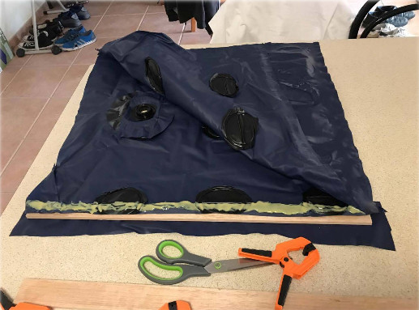

# Portable_device

This is the website containing details for the "Portable Lifting Device" project as a joint project with studendents enrolled for Mechanical and Mechatronic 3 at University of Technology, Sydney.

The project has been successfully attempted by the 2017-Spring team (Mobitronic) and 2017-Autumn team (UP Engineering). 
In particular, Mobitronic has envestigated on the subject thoroughly and explored both pneumatic concept and  mechanical concept. A prototype pneumatic demo was made with an [inflatable matress](https://drive.google.com/file/d/0B8edSPbUCKdPTHlibjlWQjhMN2M). For meachnical design, a [scissor jack stool drawing](https//github.com/liyang-liu/Portable_device/src/2017_Autumn_Mobitronic/scissor_jack_concept.mp4) is developed with detailed force/pressure calculation.
The UP Engineeirng team has manufactured a [portable airbag](https://youtu.be/5JIshlNcmgY).

# 1. Prerequisites
Solidworks

# 2. Specification
Detailed specification is given in word document "Project_for_Lifting_airbag_spring-semester.docx"
